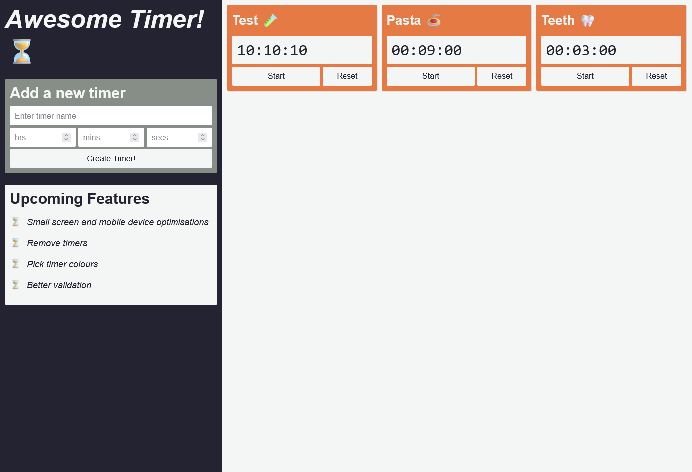

# Awesome Timer project 

Created from scratch to practice vanilla JavaScript. I spent more time trying to make everything look a little nicer for this project so got some good practice with CSS. One of the more difficult things about this project was handling creating and deleting different instances of the timers. I feel this project would have been much easier to create using a JavaScript framework to handle the different instances of timers so would like to start looking into possible JavaScript frameworks to learn. 

